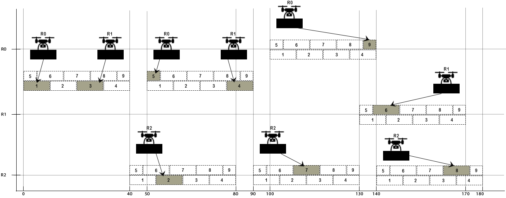

# Metaheuristic planner for cooperative multi-agent wall construction with UAVs



## Citing

If you use this code in an academic context, please cite the following publication:

B. Elkhapery, R. Pěnička, M. Němec, M. Siddiqu, **Metaheuristic planner for cooperative multi-agent wall construc-
tion with UAVs**, Automation in Construction, 2023. ([PDF](http://mrs.felk.cvut.cz/data/papers/AIC23_Elkhapery.pdf))

```
@article{Elkhapery23_AIC_UAVWallBuilding,
  author={Elkhapery, Basel and Pěnička, Robert and Němec, Michal and Siddiqui, Mohsin},
  journal = {Automation in Construction},
  title={Metaheuristic planner for cooperative multi-agent wall construction with UAVs}, 
  year={2023}
}
```

## License

GPL-3.0 License. Copyright (C) 2022 B. Elkhapery, R. Pěnička, M. Němec, M. Siddiqu (Department of Civil & Environmental Engineering, University of Delaware, and Faculty of Electrical Engineering, Czech Technical University in Prague).

This is a research code, expect that it changes often and any fitness for a particular purpose is disclaimed.

## Installation and usage

The code has been developed and tested on Ubuntu 20.04.

### Downloading the code

Clone the code repository and update the submodules.<br />
`https://github.com/ctu-mrs/CMCP_wall_building_planner.git`<br />
`cd CMCP_wall_building_planner`<br />
`git submodule update --init --recursive`

### Compilation and dependencies

Install the following dependencies:<br />
`sudo apt-get install git build-essential cmake pkg-config libyaml-cpp-dev`<br />

You can compile the code using the script<br />
`./build.sh`<br />

By default the build should compile both GRASP-based Cooperative Masonry Construction Planner (CMCP) and the MILP-based planner with CPLEX. Yet you need to specify the cplex location in cmake/Modules/FindCPLEX.cmake, set the following variables to match your setup

```
set(CPLEX_STUDIO_DIR /opt/cplex-12.8.0)
set(CPLEX_STUDIO_DIR_ /opt/cplex-12.8.0)
```

### Running the code

You can set/modify the config, i.e. *config/planner.yaml* and the problem to be solved, i.e. the *config/Test_39.txt*.

The GRASP-based CMCP can be run using:
`./cmake-build-debug/standalone/grasp/planner_standalone_grasp --problem=config/Test_39.txt --config-file=config/planner.yaml --output=results`

The MILP-based planner can be run using (with max 7200s runtime):
`./cmake-build-debug/standalone/optimal/planner_standalone_optimal --sop-solver=lp --name _all --problem=config/Test_39.txt --config-file=config/planner.yaml --output=results --maximal-calculation-time-sec 7200`
